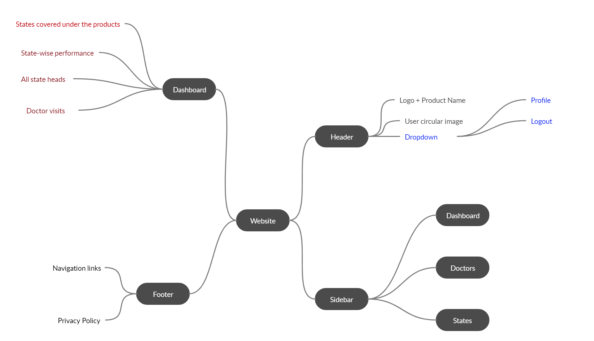
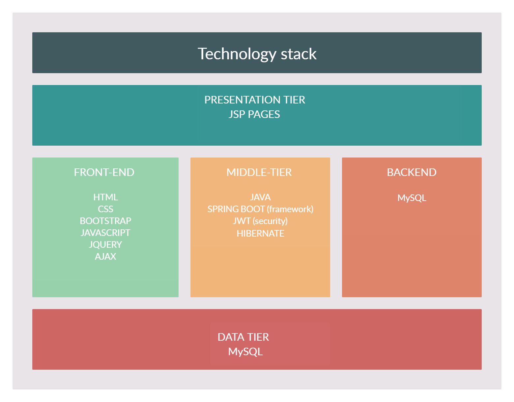

# SaleStat

SaleStat is a software product which helps the medical company to analyse their sales, in a graphical view and get a clear picture of their monthly and yearly sales status of every particular product in detail.

Product website design:

Page-wise functionality : 
1)DASHBOARD :

a)SIDEBAR : 
1. States tab should populate all the states that he operates in, according to the person who logs in.

b)CARDS : 
1. Sponsored Doctors ( Populate the total no of doctors who are sponsored and who belong to the state that the person is logged in.)
2. Expected businedd by those doctors ( Total business expectation by the doctors in that state)
3. Business by those doctors ( Total business given by the doctors in that state)
4. Total Sale (revenue generated in that state)

c)STATE PERFORMANCE :
1. Every states expected and total sales with graph should be displayed.

- On clicking on that particular state it should redirect to its respective state region graph page.

d)STATE HEADS :
 This should only be visible to the higher officials who has access to all the states information.

e)DOCTOR'S VISIT : (Future Scope)

f)SIDE CARDS : (functionality yet to be confirmed)

g) SIDE GRAPHS : (yet to be confirmed)

TECHNOLOGY STACK :

Presentation Tier( Front-End):
- HTML
- CSS
- Bootstrap
- Javascript
- Jquery
- Ajax

Middle Tier:
- Spring Boot (Framework)
- JWT (security)
- Hibernate

Data Tier:
- MySQL

User Role Hierarchy:

 

Steps to run the project : 
1) install git
2) open a folder and right click to open git bash
3) clone the master repository ( git clone https://github.com/pillieshwar/SaleStat.git)
4) install eclipse 
5) after opening eclipse right click on the project explorer and select import existing maven project.
6) then a dialog box will open, select the cloned project( it will automatically open in eclipse)
7) after importing (press ctrl+shift+r) and enter 	SpringBootHibernateApplication.java and open that file.
8) right click on it and run as java application.
9) after the application is started goto browser and enter the url: http://localhost:8090 (a login page will appear)
 
#RUN UPDATED_SCHEMA.SQL IN MYSQL ( This will create entire schema and the database will be ready for use. )
